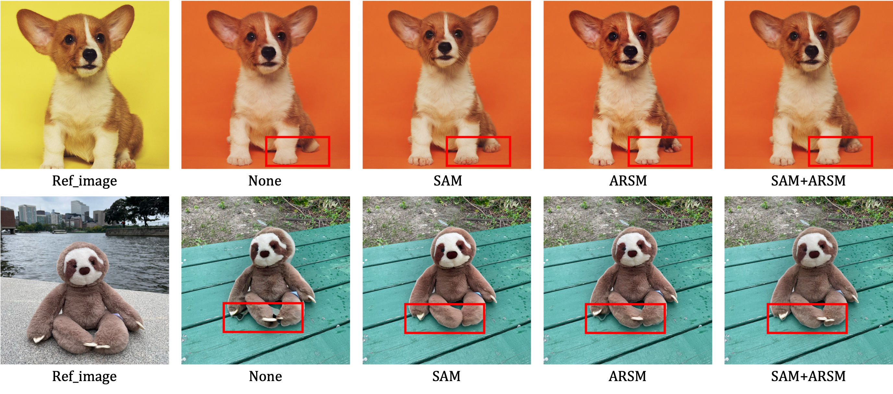
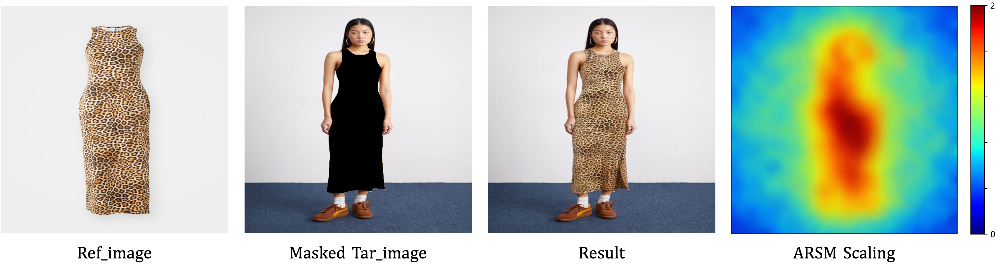

 # 📌 [**Borrowing from Anything: A Generalizable Framework for Reference-Guided Instance Editing**](https://arxiv.org/abs/2512.15138)

<!-- **Authors:** Shengxiao zhou, Chenghua Li, Jianhao Huang, Qinghao Hu, Yifan Zhang -->

 ## 🧪Ablation Studies
 ### 📊 Ablation Study of Key Components

As shown in the figure, compared with the results obtained without the SAM module, the generated teddy bear exhibits noticeable spatial misalignment. After incorporating the SAM module, this issue is effectively alleviated. In addition, the details generated on the dog’s paws become clearer and more structurally consistent with the introduction of the SAM module. Due to the complex background of the reference image, the target image relies on effectively extracting relevant information from the reference. The proposed ARSM module is able to decouple key feature information from the reference features, emphasizing regions that are highly correlated with the target while suppressing background interference. As a result, more semantically and structurally consistent details are generated on critical regions such as the dog’s paws and the teddy bear’s legs. These results demonstrate that the proposed ARSM module exhibits strong capability in feature-space alignment and key feature decoupling under complex backgrounds, leading to improved stability and finer detail quality in the generated results.

 ### 📈 Visualization of Scaling

**Visualization of ARSM Scaling:** To validate the disentanglement mechanism, we visualized the spatial scaling factor map (1+α), which modulates the reference features within the range of [0,2]. As shown in the heatmap, in a garment editing scenario, the module generates high activation values (approaching 2.0, shown in red) strictly concentrated on the garment region, effectively amplifying the intrinsic texture cues. Conversely, the background areas exhibit low activation values (approaching 0, shown in blue), indicating strong suppression of extrinsic noise. This qualitative evidence explicitly confirms that ARSM learns to "purify" the reference appearance by adaptively filtering out irrelevant attributes.

 ## 📦 Installing Dependencies
```bash
pip install -r requirements.txt
```

 ## 🧠 Model Weights
Please place the following model weight files in the corresponding directories:
- Base model: Place according to the `pretrained_Target_Unet_path` path in the configuration file
- VAE model: Place according to the `pretrained_vae_name_or_path` path in the configuration file
- Image encoder: Place according to the `image_encoder_path` path in the configuration file
- Reference model: Place according to the `pretrained_Ref_Unet_path` path in the configuration file
- GENIE checkpoint: Place according to the `ckpt_path` path in the configuration file

### 🔗 Download Links

The model weights can be downloaded from the following links:

- **Base Model**: [Download from Hugging Face](https://huggingface.co/stable-diffusion-v1-5/stable-diffusion-v1-5/tree/main)
- **VAE Model**: [Download from Hugging Face](https://huggingface.co/stabilityai/sd-vae-ft-mse)
- **Image Encoder**: [Download from Hugging Face](https://huggingface.co/openai/clip-vit-large-patch14)
- **Reference model**: [Download from huggingface Face](https://huggingface.co/botp/stable-diffusion-v1-5-inpainting/tree/main)
- **GENIE Checkpoint**: [Download from Google Drive](https://drive.google.com/file/d/19c7GQa0Swsq15boys4j39eOcsoaCuC2m/view?usp=share_link)

After downloading, place the weights in the `checkpoints` directory according to the paths specified in your configuration file.

## ⚙️ Configuration
Please check the `configs/inference.yaml` file before running to ensure all paths are set correctly.

## 🚀 Running Inference
```bash
bash run_test.sh
```

## 🗂️ Input Data
The inference script processes all reference images in the specified directory. Each test sample should include:
- ref_image.jpg: Reference image
- tar_image.jpg: Target image
- mask.png: Mask image

## 🧾 Dataset Structure
The test dataset should be organized as follows:
```
test_data_directory/
├── ref_image_1.jpg    # Reference image for sample 1
├── tar_image_1.jpg    # Target image for sample 1
├── mask_1.png         # Mask image for sample 1
├── ref_image_2.jpg    # Reference image for sample 2
├── tar_image_2.jpg    # Target image for sample 2
├── mask_2.png         # Mask image for sample 2
└── ...                      # More samples
```

The script identifies related files by their naming pattern. For each reference image named `*ref_image.jpg`, it looks for the corresponding target image and mask with the same prefix.

## 📤 Output
The inference results will be saved in the output directory specified in the configuration file, including:
- Result image
- Reference image
- Masked target image
- Original target image
- Collage image
- Performance evaluation metrics 
